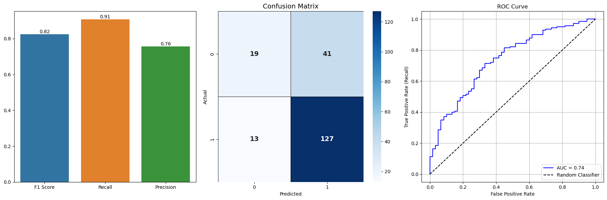

# Credit Risk

### O foco deste projeto é aplicar técnicas de Análise de Dados e Ciência de Dados para previsão de risco de crédito.

Objetivo:

Comparar modelos de machine learning e compará-los, selecionando o mais eficiente para identificar quais clientes apresentam o maior risco de crédito, ou seja qual tem a **maior probabilidade de inadimplência**, buscando auxiliar na tomada de decisão para liberação de crédito.  

---

## Etapas do Projeto

### 1. Análise Exploratória e limpeza dos dados

- Analisamos o dataset buscando um melhor entendimento das variáveis, realizando correções e verificando o comportamento das colunas, como no caso da variável **"dependents"**.
- Os outliers foram tratados com winsorização

Essa análise e tratamento permitiu lidar com os dados da forma mais adequada, visando maximizar a qualidade das predições.

### 2. Feature engineering

- Foi realizado feature engineering criando novos features, transformando-os e relacionando dados pré-existentes visando um melhor desempenho no modelo

### 3. Treinamento

- Foram testados e comparados diversos modelos:
  - **RandomForestClassifier**
  - **DecisionTreeClassifier**
  - **GradientBoostingClassifier**
  - **LogisticRegression**
  - **KNeighborsClassifier**
  - **SVC**
 
- A seleção dos melhores modelos foi realizada com o uso de **GridSearchCV**, utilizando a métrica F1 como principal critério de avaliação na fase inicial.

### 4. Avaliação

- Foi realizada uma comparação entre técnicas de balanceamento: **NearMiss** (under-sampling) e **SMOTE** (over-sampling).

- Todos os modelos foram testados utilizando ambas as técnicas, comparando seus desempenhos. A partir desta análise, **SMOTE** foi selecionado como o melhor método de balanceamento.

- Em seguida, os modelos que apresentaram melhor desempenho com SMOTE — **LogisticRegression** e **SVC** — foram comparados de forma mais aprofundada, utilizando a amostra de teste.

### 5. Resultados
- Apos os testes o modelo de **LogisticRegression** foi selecionado, por apresentar valores maiores em todas as métricas, mesmo com a amostra de teste.

### 6. Conclusão

- O modelo foi considerado um bom ponto de partida mas há necessidade de melhorias

---

## Dataset

Trata-se de um dataset sobre risco de crédito, com:

- **22 colunas**  
- **1.000 linhas**

O dataset está **desbalanceado**, além de conter colunas que poderiam ser separadas e variáveis que não influenciam significativamente na análise.

Mais informações sobre o dataset podem ser obtidas neste link:  
[https://www.kaggle.com/datasets/satyajeetrai/credit-risk-dataset/data](https://www.kaggle.com/datasets/satyajeetrai/credit-risk-dataset/data)

---

## Tecnologias Utilizadas

- **Python**
- **Pandas**, **NumPy**
- **scikit-learn**
- **imbalanced-learn**
- **Matplotlib**, **Seaborn**

Foram utilizados **Pipelines** com as técnicas **SMOTE** e **NearMiss** para balanceamento dos dados.

Os modelos testados foram:

- RandomForestClassifier  
- DecisionTreeClassifier  
- GradientBoostingClassifier  
- LogisticRegression  
- KNeighborsClassifier
- SVC

As métricas utilizadas para validação do modelo foram:

- **f1_score**
- **recall_score**
- **precision_score**
- **roc_auc_score**

Sendo F1 e precision as métricas prioritárias

---

## Resultados

Diversos modelos foram testados e analisados, tendo seus resultados abaixo do esperado.

Após a análise, o modelo de **LogisticRegression** demonstrou ser o ideal para o momento, apresentando métricas melhores que seus concorrentes e demonstrando capacidade auxiliar na tomada de decisões, com necessidade de melhorias.

|f1-score|recall|precision|auc-roc|
|---|---|---|---|
|56|55|57|73|

---

## Considerações

- O **balanceamento** e a técnica escolhida afetam significativamente a performance dos modelos. Por isso, é fundamental testar diferentes estratégias.

- Mesmo com valores aparentemente fora do padrão (outliers), é necessário uma análise aprofundada para validar suas características individuais e se devem ou não ser demovidas.  

- A remoção de features pouco relevantes (via SHAP) impactou positivamente a capacidade preditiva.  

---

## Conclusão e Próximos Passos

O modelo atual serve como **ponto de partida**, mas melhorias são necessárias para maior robustez:  

- **Aprimorar a base de dados**
- **Explorar técnicas avançadas de balanceamento**
  - Ex.: ADASYN, Borderline-SMOTE, SMOTE-ENN
- **Avançar na feature engineering**
  - Criar variáveis mais complexas e relevantes
- **Testar algoritmos mais robustos**
  - Ex.: XGBoost, LightGBM com ajuste de `scale_pos_weight`
- **Validações mais rigorosas**
  - Cross-validation estratificada e datasets externos  

O projeto reforça a importância de uma análise cuidadosa dos dados e da engenharia de variáveis para construir modelos de crédito eficazes. O **LogisticRegression** selecionado já entrega resultados úteis, mas a coleta de novos dados e o teste de técnicas avançadas são fundamentais para elevar a confiabilidade do sistema.