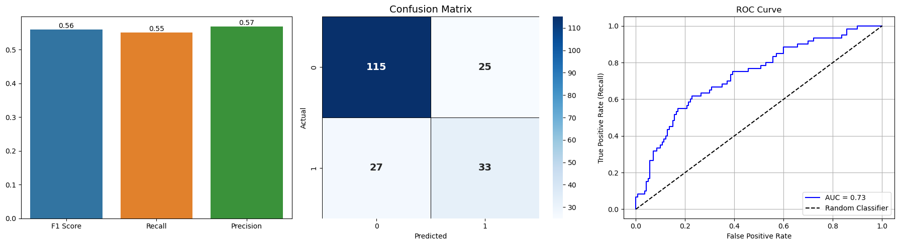

# Credit Risk

## Descrição

O foco deste projeto é aplicar técnicas de Análise de Dados e Ciência de Dados para previsão de risco de crédito.

## Objetivo

Criar modelos de Machine Learning (ML) e compará-los, selecionando o mais eficiente para identificar quais clientes têm maior propensão a pagar o crédito emprestado, auxiliando na tomada de decisão para liberação de crédito.  
O objetivo também visa reduzir falsos positivos e falsos negativos, ou seja, evitar a liberação de crédito para clientes inadimplentes e garantir a concessão para clientes adimplentes.

As principais métricas selecionadas para essa tarefa foram **F1** e **Recall**:

- **F1-score** foi escolhida por ser a média harmônica entre recall e precision, equilibrando os dois aspectos críticos deste problema.
- **Recall** foi priorizado como métrica secundária, pois, apesar da importância da precisão, o recall é responsável por indicar quantos dos casos positivos foram corretamente identificados.

---

## Etapas do Projeto

### 1. Análise Exploratória

- Analisamos o dataset buscando um melhor entendimento das variáveis, realizando correções e verificando o comportamento das colunas, como no caso da variável **"Number of people being liable to provide maintenance for"**.
- Essas análises permitiram lidar com os dados da forma mais adequada, visando maximizar a qualidade das predições.

### 2. Treinamento

- Foram testados e comparados diversos modelos:
  - **RandomForestClassifier**
  - **DecisionTreeClassifier**
  - **GradientBoostingClassifier**
  - **LogisticRegression**
  - **KNeighborsClassifier**
  
- A seleção dos melhores modelos foi realizada com o uso de **GridSearchCV**, utilizando a métrica F1 como principal critério de avaliação na fase inicial.

### 3. Avaliação

- Foi realizada uma comparação entre técnicas de balanceamento: **NearMiss** (under-sampling) e **SMOTE** (over-sampling).

- Todos os modelos foram testados utilizando ambas as técnicas, comparando seus desempenhos. A partir desta análise, **SMOTE** foi selecionado como o melhor método de balanceamento.

- Em seguida, os modelos que apresentaram melhor desempenho com SMOTE — **RandomForestClassifier** e **GradientBoostingClassifier** — foram comparados de forma mais aprofundada, utilizando a amostra de teste.

- O **fator de desempate** foi o **Recall**, pois a capacidade de identificar corretamente os clientes inadimplentes é fundamental para mitigar riscos.

### 4. Conclusão

- O modelo **RandomForestClassifier** foi selecionado como o mais eficaz para as predições, baseado nas métricas escolhidas e nos resultados obtidos.

---

## Dataset

Trata-se de um dataset sobre risco de crédito, com:

- **22 colunas**  
- **1.000 linhas**

O dataset está **desbalanceado**, além de conter colunas que poderiam ser separadas e variáveis que não influenciam significativamente na análise.

Mais informações sobre o dataset podem ser obtidas neste link:  
[https://www.kaggle.com/datasets/satyajeetrai/credit-risk-dataset/data](https://www.kaggle.com/datasets/satyajeetrai/credit-risk-dataset/data)

---

## Tecnologias Utilizadas

- **Python**
- **Pandas**, **NumPy**
- **scikit-learn**
- **imbalanced-learn**
- **Matplotlib**, **Seaborn**

Foram utilizados **Pipelines** com as técnicas **SMOTE** e **NearMiss** para balanceamento dos dados.

Os modelos testados foram:

- RandomForestClassifier  
- DecisionTreeClassifier  
- GradientBoostingClassifier  
- LogisticRegression  
- KNeighborsClassifier

As métricas utilizadas para validação do modelo foram:

- **f1_score**
- **recall_score**
- **precision_score**
- **roc_auc_score**

Sendo **F1** e **Recall** as principais.

---

## Resultados

Diversos modelos foram analisados, com uma comparação mais profunda entre **RandomForestClassifier** e **GradientBoostingClassifier**, que apresentaram resultados muito próximos.

Após a análise, o modelo de **Floresta Aleatória** (RandomForest) demonstrou ser o mais eficiente, com base nos critérios do negócio, apresentando:

- Maior capacidade de redução de falsos positivos e falsos negativos.
- Maior **Recall**, essencial para evitar prejuízos.

Com isso, o modelo mostra-se mais confiável para auxiliar na tomada de decisão na aprovação de crédito.

---

## Considerações

- O **balanceamento** e a técnica escolhida afetam significativamente a performance dos modelos. Por isso, é fundamental testar tanto estratégias de **over-sampling** quanto de **under-sampling**.

- Mesmo com valores aparentemente fora do padrão (outliers), é necessário uma análise aprofundada para validar se realmente são outliers.  
Por exemplo, a coluna **"Number of people being liable to provide maintenance for"** apresenta apenas os valores 1 e 2, o que não caracteriza outliers.  
Tratar esses valores como tal poderia enviesar os modelos.

---

## Conclusão

O projeto demonstrou a importância de:

- Uma análise cuidadosa do dataset.
- A escolha criteriosa das técnicas de pré-processamento e modelagem.

O modelo final obteve desempenho satisfatório e pode ser aprimorado com:

- Testes de novos algoritmos.
- Ajustes mais refinados de hiperparâmetros.
- Ampliação do dataset para maior robustez e generalização.
- Uso de tecnicas de visualização de dados para identificar a influencia de cada caracteristica nos resultados do treinamento.

---